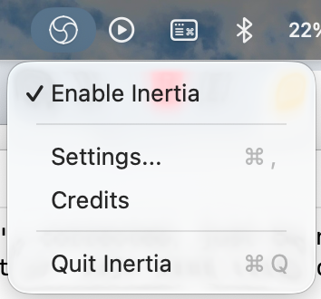
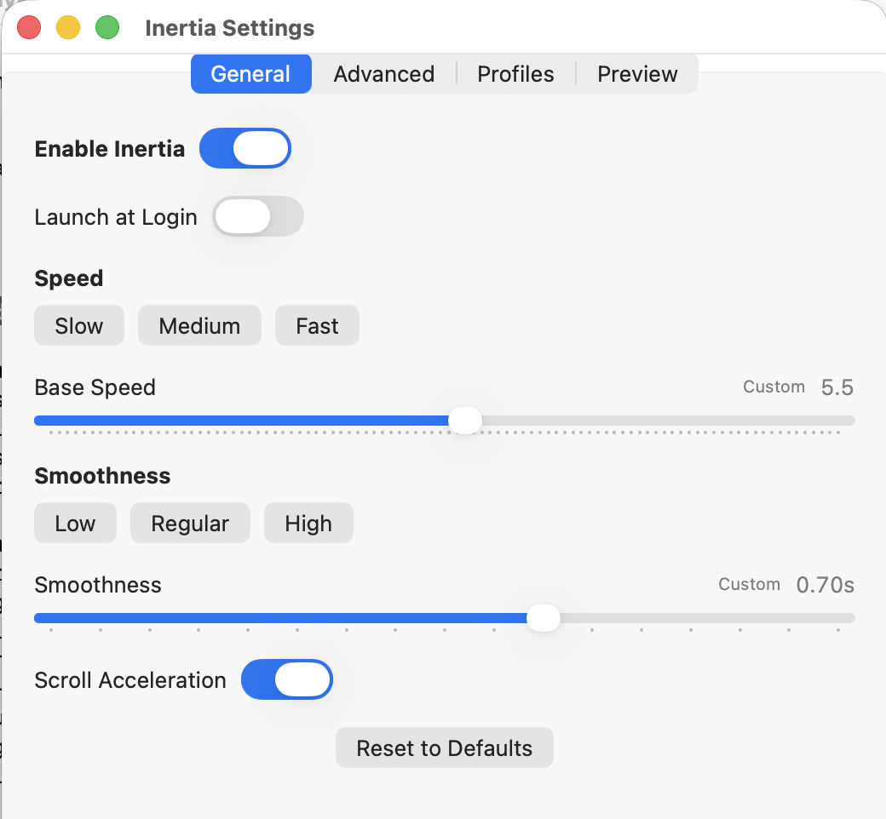
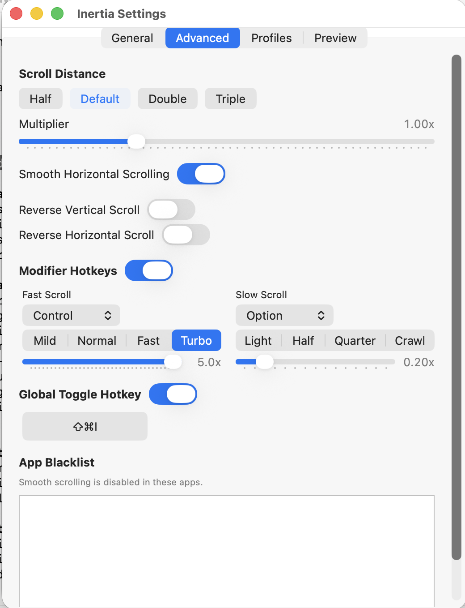
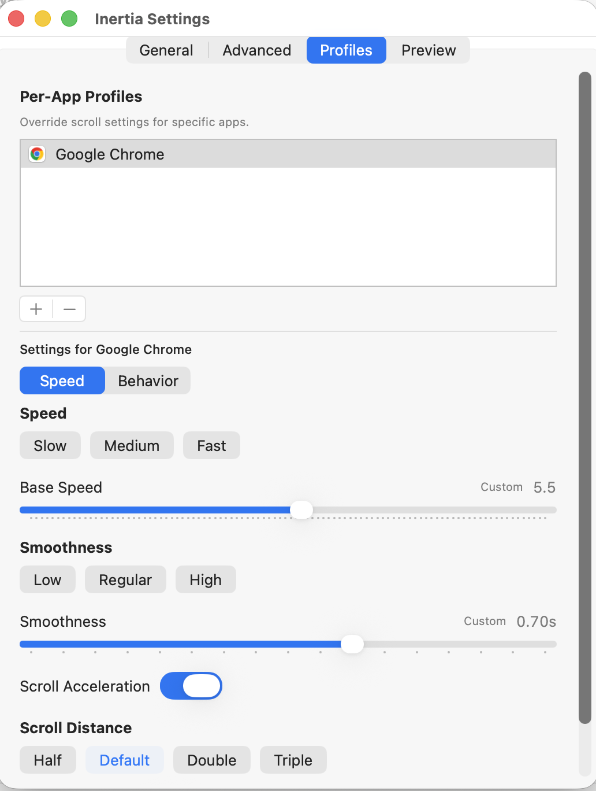
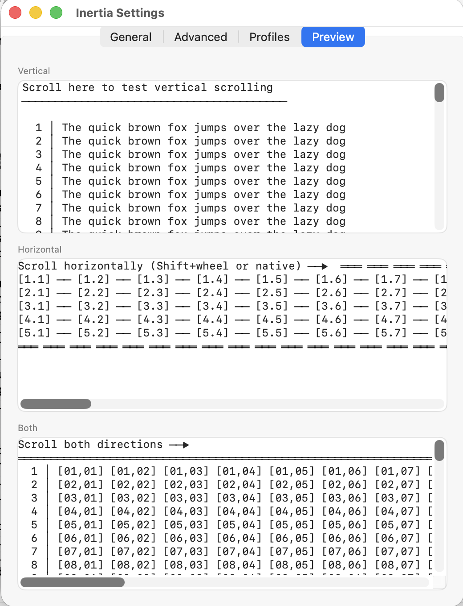

# Inertia

**Smooth, physics-based mouse scrolling for Mac.**

Inertia replaces the stepped, clunky feel of mouse wheel scrolling on macOS with smooth inertial scrolling — giving any mouse the natural momentum feel of a trackpad.

---

## The Problem

macOS treats mouse wheels and trackpads completely differently. Trackpads get beautiful, fluid scrolling with momentum. Mouse wheels get choppy, line-by-line jumps. If you use a mouse, you're stuck with scrolling that feels like it's from 2005.

## The Solution

Inertia intercepts mouse wheel events and replaces them with smooth, physics-based scrolling. Each wheel tick generates momentum that coasts naturally, just like a trackpad. The result is scrolling that feels fluid, responsive, and satisfying.

---

## Why Inertia?

Most smooth scrolling apps either charge you upfront, lock features behind a paywall, or bundle in a bunch of stuff you don't need. Inertia gives you more for free than any competitor charges for.

| | **Inertia** | Mac Mouse Fix | Mos | SmoothScroll | Smooze Pro |
|---|---|---|---|---|---|
| **Price** | **Free** | $2.99 | Free | $10/year | $19.99 |
| **Open source** | **Yes** | Yes | Yes (NC) | No | No |
| **Native Swift/SwiftUI** | **Yes** | Obj-C | Obj-C | No | No |
| **Smooth scrolling** | **Yes** | Yes | Yes | Yes | Yes |
| **Speed presets** | **Yes** | 3 presets | No | No | No |
| **Custom speed slider** | **Pro** | No | Yes | Yes | Limited |
| **Smoothness control** | **Presets (free) + slider (Pro)** | 3 presets | Duration slider | No | No |
| **Scroll distance control** | **Presets (free) + slider (Pro)** | No | Step size | Sensitivity | Line count |
| **Scroll distance presets** | **Yes** | No | No | No | No |
| **Modifier hotkeys** | **Pro (2 keys)** | Yes (4 keys) | Yes (speed-up key) | No | Partial |
| **Per-app scroll profiles** | **Yes** | No | Yes | No | Yes |
| **Per-app blacklist** | **Yes** | No | Yes | Yes | Yes |
| **Reverse scroll direction** | **Per-axis** | Single toggle | Per-axis | Single toggle | Per-axis |
| **Horizontal scrolling** | **Yes** | Yes | Yes | No | Yes |
| **Scroll acceleration toggle** | **Yes** | No | No | No | Yes |
| **Global toggle hotkey** | **Yes (unique)** | No | Hold-to-suppress | No | No |
| **Live preview** | **Yes (unique)** | No | Scroll monitor | No | No |
| **Menubar-only (no Dock icon)** | **Yes** | No | Yes | Yes | No |
| **App size** | **~2 MB** | ~15 MB | ~10 MB | ~5 MB | ~30 MB |
| **Runtime overhead** | **Native Swift (minimal)** | Obj-C (low) | Obj-C (low) | Non-native (higher) | Non-native (higher) |
| **No subscription** | **Yes (free / $5 once)** | Yes ($2.99 once) | Yes (free) | No ($10/year) | Yes ($19.99 once) |
| **Trackpad passthrough** | **Yes** | Yes | Yes | No | Partial |
| **No telemetry** | **Yes (open source)** | Yes (open source) | Yes (open source, NC) | No | No |
| **Works in Terminal** | **Yes** | Yes | Partial | No | Partial |
| **Button remapping** | No | Yes | Yes | No | Yes |

### What you get for free

Every other app in this space either charges upfront or strips out essential features. With Inertia:

- **Speed, smoothness, and distance presets** — all free. Slow, Medium, Fast. Low, Regular, High. Half, Default, Double, Triple. Pick one and go.
- **Reverse scroll, horizontal scroll, acceleration toggle** — all free.
- **Global toggle hotkey** — free. One keyboard shortcut to enable/disable from anywhere.
- **Custom sliders, modifier hotkeys, per-app profiles, and blacklist** — available with Inertia Pro ($5, optional). Power-user features for fine-tuning and per-app customization.

**Inertia's free version covers what most paid apps charge for.** Pro adds fine-tuning and per-app customization for $5 — no trials, no subscriptions, no nag screens.

---

## Features

### Free
- **Smooth inertial scrolling** — physics-based momentum that coasts naturally after each wheel tick
- **Speed presets** — Slow, Medium, Fast
- **Smoothness presets** — Low, Regular, High
- **Scroll distance presets** — Half, Default, Double, Triple
- **Scroll acceleration toggle** — disable the speed curve for linear, constant-speed scrolling
- **Reverse scroll direction** — independent per-axis toggles for vertical and horizontal
- **Smooth horizontal scrolling** — hold Shift to scroll horizontally with the same smooth momentum
- **Global toggle hotkey** — customizable keyboard shortcut to enable/disable Inertia from anywhere
- **Live preview** — test your settings inside the app before using them system-wide
- **Launch at login** — optionally start Inertia automatically on boot
- **Lightweight** — menubar-only, no Dock icon, runs silently in the background
- **Mouse-only** — trackpad scrolling is left completely untouched
- **Works everywhere** — consistent scroll feel across all apps including Terminal

### Inertia Pro ($5, optional)
- **Custom sliders** — fine-tune your exact speed, smoothness, and scroll distance beyond presets
- **Modifier hotkeys** — hold Control to scroll faster, Option to scroll slower, with customizable keys and multipliers
- **Per-app scroll profiles** — override speed, smoothness, distance, and modifier settings for specific apps
- **Per-app blacklist** — disable smooth scrolling entirely for specific apps

Power-user features for fine-tuning and per-app customization. The free version is fully functional without them.

---

## Lives in Your Menu Bar

Inertia runs entirely from the menu bar — no Dock icon, no floating windows, no splash screen. It starts on login, sits quietly in the corner, and stays out of your way. Apps like Mac Mouse Fix and Smooze Pro open as full applications with Dock icons and persistent windows. Inertia doesn't — click the menu bar icon to adjust settings or toggle on/off, and that's it.

## Built for Performance

Inertia is written in pure Swift with SwiftUI — the same native technologies Apple uses for its own apps. This matters:

- **~2 MB on disk** — most competitors are 10–50 MB
- **Minimal CPU usage** — native Swift compiles to optimized machine code, no runtime interpreter or garbage collector overhead
- **Low memory footprint** — no Electron, no Java, no web views. Just native macOS code running close to the metal
- **120Hz animation loop** — smooth momentum without waking the CPU more than necessary

Competitors like SmoothScroll and Smooze Pro use non-native frameworks that carry significant overhead for a utility that should be invisible. Older apps like Mac Mouse Fix and Mos are written in Objective-C, which works but lacks Swift's modern memory safety and performance optimizations. Inertia is built to do one thing efficiently and get out of the way.

## Open Source & Transparent

Inertia is fully open source. This matters for a scroll utility because it runs with Accessibility permissions — one of the most powerful entitlements on macOS. With closed-source apps like SmoothScroll and Smooze Pro, you're trusting that a privileged background process isn't doing anything it shouldn't. With Inertia, you can read every line of code yourself.

- **No telemetry, no analytics, no phone-home** — verifiable, not just claimed
- **No obfuscated code** — the scroll engine, event interception, and settings are all readable Swift
- **Community auditable** — anyone can inspect, fork, or contribute
- **Fully open license** — Mos uses a NonCommercial license that restricts how you can use and distribute it. Inertia's license allows free use and modification with attribution.

---

## Screenshots

### Menu Bar

### General Settings

### Advanced Settings

### Per-App Profiles

### Live Preview

---

## Installation

### Download
Download the latest `.app` from [Releases](https://github.com/JayKayDude/Inertia/releases).

> **Note:** Inertia is not currently signed or notarized. On first launch, right-click the app and select **Open**, then click **Open** in the dialog. This is only needed once. Signed distribution may be added in the future.

### Build from Source
1. Clone this repo
2. Open `Inertia.xcodeproj` in Xcode
3. Build and run (Cmd+R)
4. Grant Accessibility permission when prompted

---

## Requirements

- macOS Sequoia (15.0) or later
- A USB or Bluetooth mouse with a scroll wheel
- Accessibility permission (required for scroll event interception)

---

## How It Works

Inertia creates a low-level event tap (`CGEventTap`) that intercepts mouse wheel events before they reach applications. Each wheel tick is converted into smooth momentum using a physics-based speed curve adapted from [Mac Mouse Fix](https://github.com/noah-nuebling/mac-mouse-fix). A high-frequency timer (120Hz) applies friction to the velocity each frame, producing natural deceleration.

The engine constructs scroll events that match macOS's native continuous scroll format, so every app — including Terminal — receives consistent, smooth input.

---

## FAQ

**Does it work with my mouse?**
Yes — any USB or Bluetooth mouse with a scroll wheel. Logitech, Razer, SteelSeries, generic mice, etc. If macOS sees it as a mouse (not a trackpad), Inertia will smooth it.

**Does it affect my trackpad?**
No. Inertia only intercepts mouse wheel events. Trackpad scrolling is left completely untouched — your Magic Trackpad or built-in MacBook trackpad will work exactly as before.

**Is it safe? It asks for Accessibility permissions.**
Accessibility permission is required because Inertia intercepts scroll events at the system level (via `CGEventTap`). This is the same permission every scroll utility needs. Since Inertia is open source, you can verify exactly what the code does — there's no telemetry, no analytics, and no network access.

**Can I use it alongside other mouse utilities?**
Generally yes, but avoid running two smooth scrolling apps at the same time (e.g., Inertia + Mos) since they'll both try to intercept the same events. Other utilities like button remappers should work fine.

**How do I disable it for specific apps?**
Use the App Blacklist in the Advanced tab (Pro feature). Add any app where you want normal stepped scrolling — useful for certain games or apps with custom scroll behavior.

**What's the difference between free and Pro?**
The free version includes presets for speed, smoothness, and scroll distance, plus all toggles (acceleration, reverse scroll, horizontal scroll, global hotkey). Pro ($5) adds custom sliders for fine-tuning, modifier hotkeys, per-app scroll profiles, and per-app blacklist.

---

## Uninstall

1. Quit Inertia from the menu bar (or right-click the menu bar icon and select **Quit Inertia**)
2. Drag `Inertia.app` to the Trash
3. Optionally remove preferences: `defaults delete com.JayKayDude.Inertia`
4. Optionally remove the login item from **System Settings > General > Login Items**

No kernel extensions, no launch daemons, no leftover processes. It's just an app.

---

## Credits

Inertia's scroll physics are adapted from [Mac Mouse Fix](https://github.com/noah-nuebling/mac-mouse-fix) by Noah Nuebling. Inertia is a derivative work with substantial changes: completely rewritten engine in pure Swift, new SwiftUI interface, stripped to smooth scrolling only, and released free and open source. Full attribution is maintained in the app's Credits window.

App icon created by [Freepik — Flaticon](https://www.flaticon.com/free-icons/inertia).

---

## License

Inertia License (based on the [MMF License](https://github.com/noah-nuebling/mac-mouse-fix/blob/master/License)) — free to use and modify. Derivative works must attribute Inertia and may not be sold unless they represent substantial independent work. See [LICENSE](LICENSE) for details.

---

## Contributing

Issues and PRs welcome.
